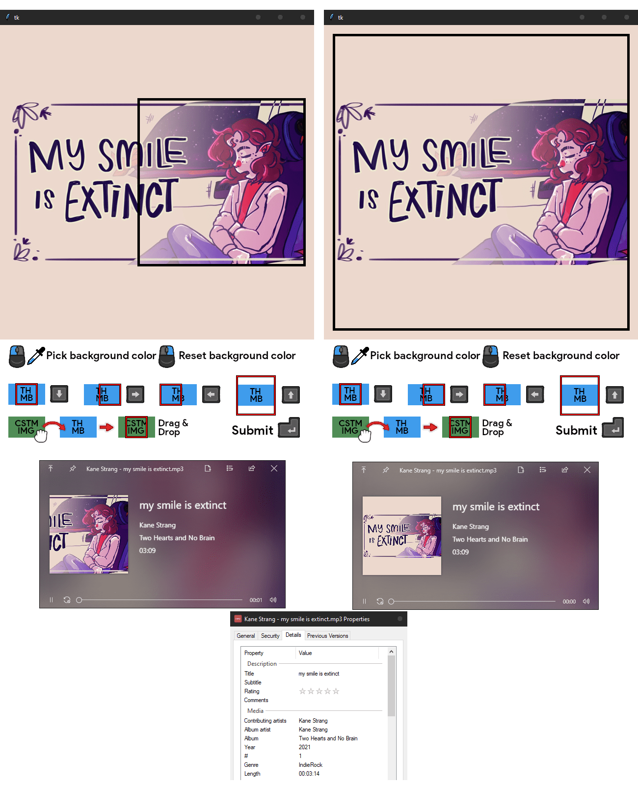

# tiger 
```
  
▄▄▄█████▓  ██▓ ▄████  ▓█████ ██▀███  
▓  ██▒ ▓▒▒▓██▒ ██▒ ▀█ ▓█   ▀▓██ ▒ ██▒
▒ ▓██░ ▒░▒▒██▒▒██░▄▄▄ ▒███  ▓██ ░▄█ ▒
░ ▓██▓ ░ ░░██░░▓█  ██ ▒▓█  ▄▒██▀▀█▄  
  ▒██▒ ░ ░░██░▒▓███▀▒▒░▒████░██▓ ▒██▒
  ▒ ░░    ░▓  ░▒   ▒ ░░░ ▒░ ░ ▒▓ ░▒▓░
    ░    ░ ▒ ░ ░   ░ ░ ░ ░    ░▒ ░ ▒ 
  ░ ░    ░ ▒ ░ ░   ░     ░    ░░   ░ 
           ░       ░ ░   ░     ░     
```
> youtube music downloader for lazy perfectionists. 

Have you ever downloaded music from youtube, but a bunch of stuff is wrong with it?
Like there's no album cover, half the tags are missing, the bitrate is questionable and the filename has the downloader's name appended at the end? Yeah, me too, that's why i've made this.
  
# features
- **fast & easy to use**. usually just hit enter a few times to confirm the tags.
- **download in the highest bitrate youtube provides** (128kbps)
- **automatically infer most of the tags** from the music video (you can enter the remaining ones)
- **tkiner GUI** to quickly crop/pad the video thumbnail as an album cover
  - **with Drag & Drop support**: you can drop a new cover into the tkinter window to override it.
- **smart stripping/parsing of url** (youtube music, youtube, timestamp, playlist)
- **option to auto transcode** to 128kb/s (to ensure consistency) or 320kb/s (if you're a madlad, you can change it in the code lol)
  
# install & usage
```
$ pip install -r requirements.txt
```
create a `config.json` file with these options:
```json
{
    "savedir": "whatever your save dir for music is (absolute path is best)",
    "save_json_dump": false,
    "skip_reencode": true,
    "ffmpeg_location" : "not neccesary if ffmpeg is installed globally / in PATH",
    "id3v": "either '2.3' or '2.4' (not required)"
}
```
- **save_json_dump** is useful for debugging or if you want extra info about the song in json  
- **skip_reencode** can be kept on true by default. `yt-dlp` does a pretty good job of downloading in exactly *128kb/s*, but if you want to make sure its *128kb/s*, you can enable this to have `ffmpeg` re-encode it. (requires the `LAME` mp3 encoder be present on system)  
- **ffmpeg_location** is better if defined on windows unless you're sure you have `ffmpeg` in PATH.  
if you don't have `ffmpeg` in PATH, point it at a `ffmpeg` binary like so: `D:/coding/yt-dlp/ffmpeg-master-latest-win64-gpl-shared/bin/ffmpeg.exe`  
- **id3v** is the ID3 version. 2.3 has better support across music players, but dates are only kept as year, not full date. If you care about the dates, set this to 2.4, otherwise it's best to keep at 2.3
    
only thing left is to run it! `python musicdl.py` from this folder. (idk how to make it a global command *yet*)  
it is best to go directly to `music.youtube.com` (even if you don't have it paid), click on the 'song' item and paste in the `music.youtube.com/watch?v=...` link. This ensures most metadata get detected = less work for you.
  
# notes
- this should be used mostly for songs that aren't on spotify, but only on youtube. If the songs is on spotify/deezer, there are tools which can download it in much higher quality. This downloads in 128kbps which is not great but not terrible. If you're okay with 128kbps, feel free to use this.
- **why python?????** cause most youtube downloading stuff is already written in python
- **why tkinter????** because i couldn't be bothered to set up flask. this works well enough.
- **why mp3????** with the medium quality youtube provides, it doesen't make sense to transcode to flac or whatever. You can pr ogg transcoding if you feel like adding it.
- **why tiger????** i had an empty bottle of tiger energy drink in front of me + it sounds cool & has a cool ascii art
- it should *in theory* be able to download full playlists but i haven't tested it.
- you can use https://greasyfork.org/en/scripts/446275-youtube-screenshoter to get any frame of an youtube video quickly (hold ctrl to download instead of clipboard)
  
# screenshots

  
## credits
- [phinger cursors](https://github.com/phisch/phinger-cursors) and [xelu's controller prompts](https://thoseawesomeguys.com/prompts/) used for instructions